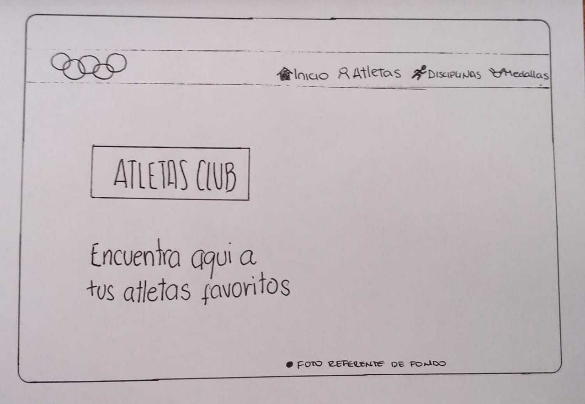
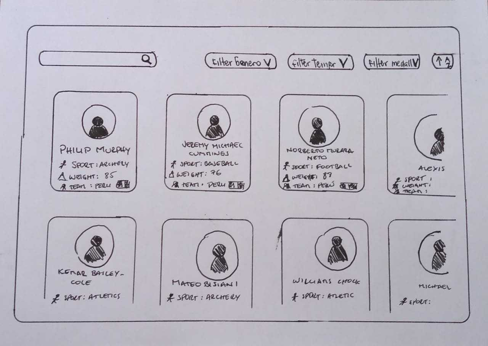
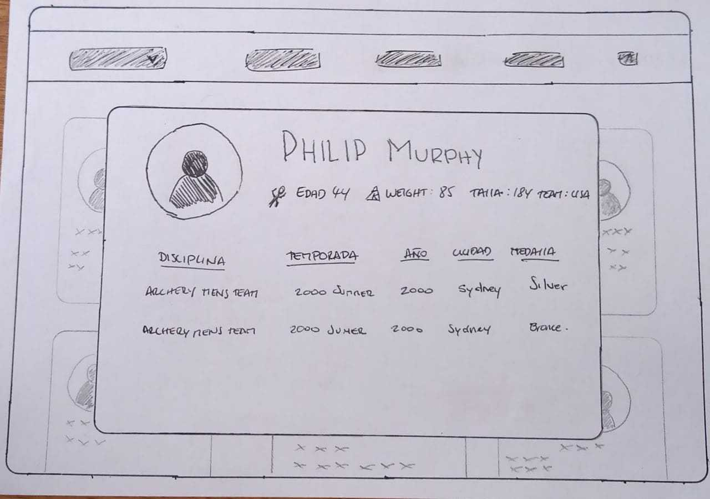
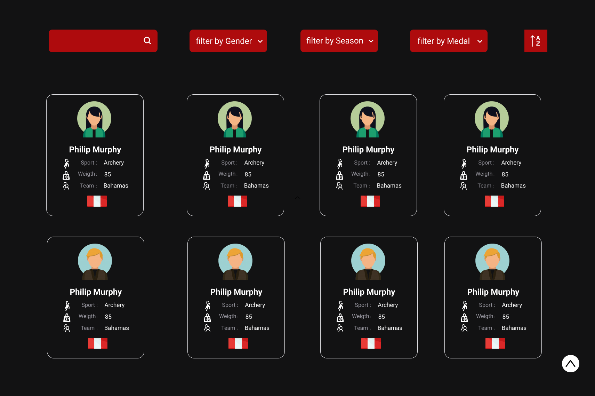
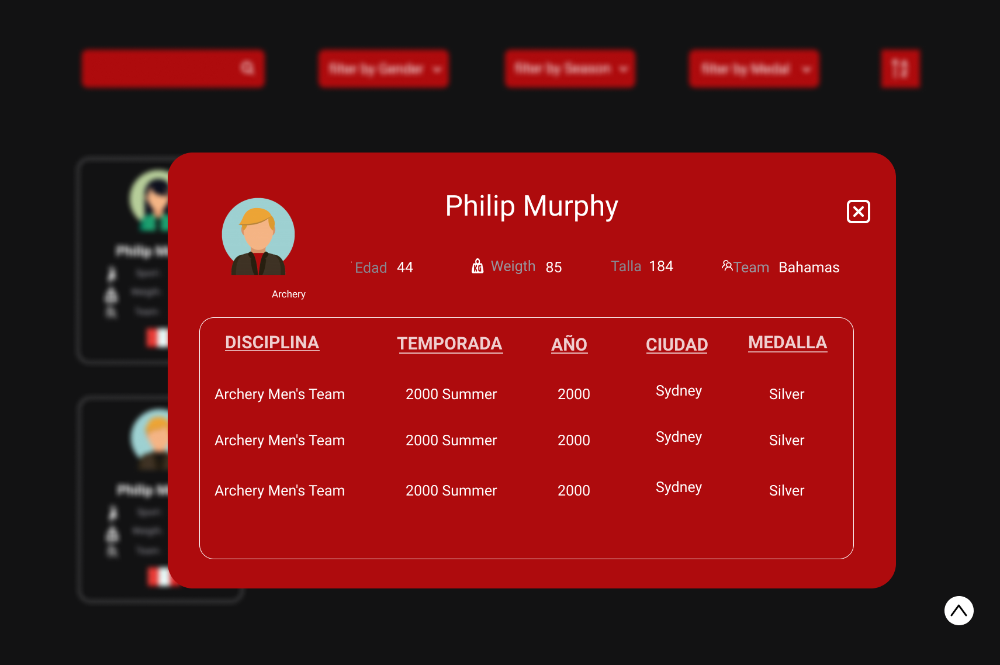

# ATLETAS CLUB 🤽 🥊

Esta página web permite a lxs usuarixs, poder encontrar a los atletas de juegos olimpicos, filtrandolos por género, tipo de medalla y deporte ,con el objetivo de encontrar la información necesaria de las carácteristicas de los atletas a quienes admiran, con la finalidad de entregarles una informacion que requieran para su entrenamiento para dichos juegos.

## Investigación UX 🕵️‍♂️

- _¿QUIENES SON LOS PRINCIPALES USUARIOS DEL PRODUCTO?_

  Lxs aspirantes interesados en participar en los juegos
  olimpicos y representar a su país.

- _¿CUÁLES SON LOS OBJETIVOS DE ESTOS USUARIXS EN RELACIÓN CON EL PRODUCTO?_

  el objetivo de lxs que aspiran particiar en los juegos olimpicos
  es poder encontrar a los participantes mas destacados ver el nivel de
  competecia que existe y poder tener un entrenamieto en base a cierto objetivo.

- _¿CUÁLES SON LOS DATOS MAS IMPORTANTES QUE QUIEREN VER EN LA INTERFAZ Y POR QUÉ?_

  -A los aspirantes que ya tienen definido un deporte en particular, poder ver a los atletxs que optuvieron medalla de oro, cobre,bonce, ver su
  peso, talla y país.

  -A los aficionados poder tener una vista general de los atletxs que representan a su pais.

- _¿CUALES SON LOS OBJETIVOS DE LOS USUARIOS EN RELACION CON EL PRODUCTO?_

  su objetivo es ver el perfil del atleta 'soñado' para alcanzar su meta.

- _¿CÓMO UTILIZAN O UTILIZARÍAN EL PRODUCTO?_

  ## Historias de usuario 
  ---

  ### **Historia de Usuario N° 1** 🧐

    **Descripción :** Yo como aspirante a juegos olimpicos, quiero poder buscar atletas de una temporada en particular, para conocer los deportes y ver con cual me siento identificadx.
  
    **Criterios de Aceptación :** 

    ♥ El usuario encontrara un boton que le muestre la opcion de ver todos los atletas por temporada

    ♥ El usuario podrá ordenarlos a los atletas alfabéticamente.

    ♥ El usuario podra encontrar informacion relevante de los atletas que coincidan con el deporte por temporada

    **Defición de terminado :**

    ♥ El prototipo de baja fidelidad debe recibir testeo y feedback.

    ♥ Uso de Slint para buenas prácticas.

    ♥ Subir a Github.

    ♥ Desplegar el proyecto en gh pages.

  ### **Historia de Usuario N° 2** 🧐

    **Descripción :** Yo como aspirante a juegos olímpicos, quiero encontrar un buscador para encontrar con facilidad  a los atletas por su nombre.

    **Criterios de Aceptación :**
    
    ♥ El usuario encontrara coincidencias según digite las letras en su busqueda.

    ♥ El usuario podra visualizar información relevante del atleta que busca por nombre.

    **Defición de terminado :**

    ♥ El prototipo de baja fidelidad debe recibir testeo y feedback.

    ♥ Uso de Slint para buenas prácticas.

    ♥ Subir a Github.

    ♥ Desplegar el proyecto en gh pages.

  ### **Historia de Usuario N° 3** 🧐

    **Descripción :** Yo como aspirante a juegos olimpicos, quiero poder ver el perfil de los atletas, para conocer más características de ellos con respecto a las disciplinas, medallas ganadas, etc.

    **Criterios de Aceptación :**

    ♥ El usuario podrá acceder al perfil del atleta haciendo click al card. 

    ♥ El usario podrá visualizar de forma ordenada las características del atleta y el detalle de su participación de los juegos olimpicos.

     **Defición de terminado :**

    ♥ El prototipo de baja fidelidad debe recibir testeo y feedback.

    ♥ Uso de Slint para buenas prácticas.

    ♥ Subir a Github.

    ♥ Desplegar el proyecto en gh pages.

    
  ### **Historia de Usuario N° 4** 🧐

    **Descripción :** Yo como aspirante a juegos olimpicos, quiero encontrar a los atletas agrupados por tipo de medalla obtenida, para aspirar a dicha medalla.

    **Criterios de Aceptación :**

    ♥ El usuario encontrara obciones para elegir a los atletas por tipo de medalla (oro, plara y cobre).

   **Defición de terminado :**

    ♥ El prototipo de baja fidelidad debe recibir testeo y feedback.

    ♥ Uso de Slint para buenas prácticas.

    ♥ Subir a Github.

    ♥ Desplegar el proyecto en gh pages.

  ## Prototipo de baja fidelidad

   **Primera pantalla**
  

  **Segunda pantalla**
  

  **Modal**
  

  ## Prototipo de alta fidelidad

  **Primera pantalla**
  

  **Segunda pantalla**
  

  **Modal**
    

## 9. Checklist

- [x] Usa VanillaJS.
- [x] No hace uso de `this`.
- [ ] Pasa linter (`npm run pretest`)
- [ ] Pasa tests (`npm test`)
- [ ] Pruebas unitarias cubren un mínimo del 70% de statements, functions y
      lines y branches.
- [x] Incluye _Definición del producto_ clara e informativa en `README.md`.
- [x] Incluye historias de usuario en `README.md`.
- [ ] Incluye _sketch_ de la solución (prototipo de baja fidelidad) en
      `README.md`.
- [x] Incluye _Diseño de la Interfaz de Usuario_ (prototipo de alta fidelidad)
      en `README.md`.
- [ ] Incluye link a Zeplin en `README.md`.
- [ ] Incluye el listado de problemas que detectaste a través de tests de
      usabilidad en el `README.md`.
- [x] UI: Muestra lista y/o tabla con datos y/o indicadores.
- [ ] UI: Permite ordenar data por uno o más campos (asc y desc).
- [ ] UI: Permite filtrar data en base a una condición.
- [ ] UI: Es _responsive_.
